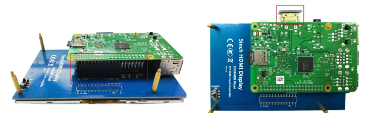
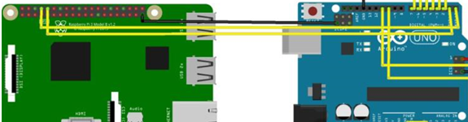

# OnCare-app

## Introduction:

A Raspberry Pi app called OnCare that is responsible for uploading the patient's data to the database.
I am using the Raspberry Pi (RPI) as an interface between the Arduino which sends the sensors data, and the Database.

RPI takes the sensor’s data from the Arduino using a serial communication UART protocol and sends this data to the Firebase Realtime database through a wireless connection. Hence, the end-user e.g. the doctor will be able to see the indications of each patient.

RPI sends the data to the cloud (Firebase). Then the Mobile and LabVIEW applications will then retrieve the data from the server and display it to the doctor and anyone else who has access to the server.

## RPI tasks:
 1.   Receive the sensors’ data from the Arduino.
 2.   Analyzing, segmenting, and cleaning the received data.
 3.   Apply the ECG signal to the ML model to classify the class of the patient.
 4.   Send the data to the database in Real-time.
 5.   Display a Graphical user interface (GUI) application to make the patient interact with the system. 
 The user can do the following through the GUI application:
- Login 
- Sign up	
- Display his data offline

## Preparation:
Before executing the application, the touch screen should be connected to Raspberry pi as follows:



Also, the TX and RX pins must be connected in both Raspberry Pi and Arduino as follows:




After that, the RPI should have the required packages for the task. So, the following packages will be installed:
- PySimpleGUI: this package is used to make the patient interact with our system.
- Pyrebase: A very fundamental package that is responsible for uploading and downloading the data from our firebase database application.
- Json: Used to scrap the received HTTP response and detect the errors regarding the process of the database HTTP requests.
- Tensorflow: This is used to apply the machine learning model to the ECG data that came from the patient. 
- firebase-admin: Used for Authenticating and Configuring the app certificate to upload to the firestore.
- threading: to excute other python script in the back ground to make the GUI program faster.
- pyserial: Used to communicate between the RPI and the Arduino.

### Requirements Installation
```
pip install pyrebase
pip install PySimpleGUI
pip install tensorflow
pip install pyserial
pip install firebase-admin
```

## Processes of the GUI Application 
### 1. Sign up 
If the user pressed the Signup button, then the application asks the user to input the personal data to assign them with the sensors readings e.g., (Name, Age, password, and email) to upload them to the database. Then the application sends the inputted data to the server to check if it is valid. If it’s not valid, then the application checks for the following conditions:
1. If the password is weak: then the app displays a message indicating that error and the user can enter a stronger password and try again.
2. If the email is not valid: then the app displays a message that indicates that error and makes the user enter the correct email.
3. If the email already exists, then the app displays a message indicating that error and makes the user log in with the email.
### 2. Login 
If the user pressed the login button, then the application asks for the email and the password. Then the application sends the inputted data to the server to check if it is valid. If it’s not valid, then the application checks for the following conditions:
1. If the password is incorrect: then the app displays a message indicating that error and the user can enter the correct password and try again.
2. If the email is not valid: then the app displays a message that indicates that error and makes the user enter the correct email.
3. If the email is not registered before then the app displays a message indicating that error and makes the user create a new account for this email.
### 3. Display patient's readings offline 
If the user pressed the display offline button, then the application displays the readings that are coming from the sensors through the Arduino.
## Processes done in background 
### 1. Database initialization
```
firebase = pyrebase.initialize_app(config)
db = firebase.database()
```
### 2. Firestore initialization
```
cred = credentials.Certificate("<yourcertificate>.json")
firebase_admin.initialize_app(cred)
fire = firestore.client()
```
### 3. Get the data from the Arduino
Using the UART, or universal asynchronous receiver-transmitter which is one of the most used device-to-device communication protocols. 
The TX of The RPI is connected to the RX of the Arduino and vice versa. As mentioned in the Hardware section. To adjust the connection between the RPI and the Arduino, the baud rate is configured to be 9600 bps on both of them.
Now the data has been stored in our memory on the RPI and we can clean, segment, and upload it to our database server.
```
#configure the file of the recived data
ser = serial.Serial('/dev/ttyACM0', 9600, timeout=1)
#reset the buffer
ser.reset_input_buffer()
```
Then the program now can start reading inside the loop:
```
line = ser.readline().decode('utf-8').rstrip()
```
Be sure to write this line inside a try and except block beacuse if the buffer is empty you will get an error while decodeing it.

### 4. AI Classification of the ECG signal
The ECG signal is applied to the Machine Learning model which will predict the class of our patient’s Heart Beats.
```
def get_predictions(lst):
    ecg_array = np.array(lst)
    ecg_array = ecg_array.reshape(1, 186, 1)
    ecg_array = ecg_array/1000
    predictions = new_model.predict(ecg_array)
    predictions=int(np.argmax(predictions,axis=1))
    return predictions
```
### 5. Data processing 
The data has to be in a dictionary from so it can be upladed properly.
```
data = {"ecg":ecg_r,"temp":temp,"SpO2":SpO2,"HB":HB,"Co2":Co2}
```
### 6. Uploading the Data 
Uploading is done automatically in the background after the patient log in to his account.
```
def upload_readings(uid,token):
    data = set_data_UART()
    db.child("patients").child(uid).child("readings").set(data,token)
    return data
```


 
